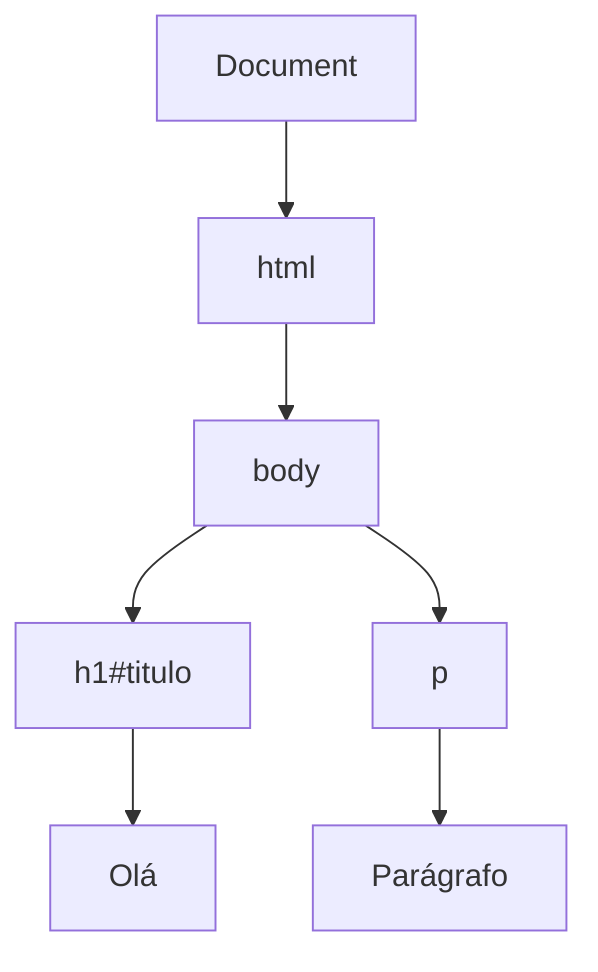

# 🌐 Tecnologias e Padrões de Navegadores (Guia Completo com Exemplos)

---

## 📌 1. Introdução

As tecnologias e padrões de navegadores são o conjunto de linguagens, regras e boas práticas que permitem que páginas web funcionem corretamente em diferentes navegadores (Chrome, Firefox, Edge, etc).

Esses padrões são definidos principalmente pelo **W3C (World Wide Web Consortium)**.

Fonte: https://www.w3.org/

👉 Objetivo:

* Garantir compatibilidade
* Melhorar acessibilidade
* Padronizar o desenvolvimento web

---

## 🧱 2. As 3 Tecnologias Fundamentais da Web

---

### 📄 2.1 HTML (Estrutura)

HTML define a **estrutura e o conteúdo** da página.

### ✅ Exemplo básico:

```html
<!DOCTYPE html>
<html>
<head>
    <title>Minha Página</title>
</head>
<body>
    <h1>Olá, mundo!</h1>
    <p>Este é um parágrafo.</p>
</body>
</html>
```

### 🧠 O que você deve saber:

* Tags básicas (`<h1>`, `<p>`, `<a>`)
* Estrutura do documento
* HTML semântico

### 📌 Exemplo semântico:

```html
<header>
    <h1>Meu Site</h1>
</header>

<main>
    <section>
        <h2>Artigos</h2>
        <article>
            <p>Conteúdo do artigo</p>
        </article>
    </section>
</main>

<footer>
    <p>Rodapé</p>
</footer>
```

👉 HTML = **estrutura + significado**

---

### 🎨 2.2 CSS (Estilo)

CSS define a **aparência** da página.

### ✅ Exemplo:

```css
body {
    background-color: #f0f0f0;
    font-family: Arial;
}

h1 {
    color: blue;
}
```

### 📌 Aplicando no HTML:

```html
<h1 style="color: red;">Título</h1>
```

Ou melhor (separação correta):

```html
<link rel="stylesheet" href="style.css">
```

---

### 📐 Layout moderno (Flexbox):

```css
.container {
    display: flex;
    justify-content: space-between;
}
```

---

### 📱 Responsividade:

```css
@media (max-width: 600px) {
    body {
        background-color: lightblue;
    }
}
```

👉 CSS = **visual + layout + responsividade**

---

### ⚙️ 2.3 JavaScript (Comportamento)

JavaScript adiciona **interatividade**.

---

### ✅ Exemplo simples:

```html
<button onclick="clicar()">Clique</button>

<script>
function clicar() {
    alert("Você clicou!");
}
</script>
```

---

## 🧠 DOM (Document Object Model)

O **DOM** é a representação do HTML em forma de **árvore de objetos** criada pelo navegador.

👉 Cada elemento HTML vira um **nó manipulável** com JavaScript.

---

### 📄 Exemplo HTML

```html
<html>
  <body>
    <h1 id="titulo">Olá</h1>
    <p>Parágrafo</p>
  </body>
</html>
```

---

### ⚙️ Exemplo de manipulação

```javascript
document.getElementById("titulo").innerText = "Novo título";
```

🔍 Isso faz:

* `document` → toda a página
* `getElementById` → busca o elemento
* `innerText` → altera o texto

---

### 🔄 Resultado

Antes: `<h1>Olá</h1>`
Depois: `<h1>Novo título</h1>`

---

### 📊 Diagrama do DOM



---

### 📡 Requisição (Fetch API):

```javascript
fetch("https://api.exemplo.com/dados")
    .then(res => res.json())
    .then(data => console.log(data));
```

## 📡 O que acontece nessa requisição (Fetch API)

* `fetch(...)` inicia uma **requisição HTTP (GET)** para a URL
* O navegador envia essa requisição ao servidor
* O servidor processa e responde (geralmente com JSON)
* `fetch` retorna uma **Promise** (operação assíncrona)
* `.then(res => ...)` executa quando a resposta chega
* `res` é um objeto **Response** (não é ainda o JSON)
* `res.json()` lê o corpo da resposta
* Essa leitura também é assíncrona (retorna outra Promise)
* O JSON é convertido para um **objeto JavaScript**
* O próximo `.then(data => ...)` recebe esse objeto
* `data` contém os dados da API já utilizáveis
* `console.log(data)` mostra os dados no console
* Enquanto isso, o restante do código continua rodando
* Se houver erro, seria tratado com `.catch()`
* Esse padrão é base para consumir APIs e integrar sistemas

---
## 🧠 3. Como o Navegador Funciona

---

### 🔄 Processo de renderização (detalhado)

1. O navegador faz a requisição HTTP e recebe o HTML
2. O HTML é convertido em uma árvore chamada **DOM**
3. Os arquivos CSS são processados → gerando o **CSSOM**
4. DOM + CSSOM são combinados → **Render Tree**
5. O navegador calcula posições e tamanhos (**Layout / Reflow**)
6. Os elementos são desenhados na tela (**Paint**)
7. Mudanças posteriores podem causar novo layout ou repaint

---

### ⚠️ Conceitos importantes

* **DOM** → estrutura do conteúdo
* **CSSOM** → regras de estilo
* **Render Tree** → estrutura final renderizada
* **Reflow (Layout)** → recalcula posições (custoso)
* **Repaint (Paint)** → redesenha sem mudar layout

---

### 🚫 Bloqueios de renderização

* CSS no `<head>` pode atrasar a renderização
* JavaScript pode interromper o processamento do HTML
* Scripts síncronos (`<script>`) pausam o carregamento

---

### 📌 Exemplo prático

```html id="9p1w7g"
<h1 id="titulo">Olá</h1>

<script>
document.getElementById("titulo").style.color = "blue";
</script>
```

👉 O que acontece:

* HTML é transformado em DOM
* O navegador encontra o `<script>` e executa
* O JavaScript altera o estilo do elemento
* O navegador realiza um **repaint** para atualizar a tela

---

### 🎯 Pontos-chave

* Ordem: HTML → CSS → JS
* JS pode bloquear ou alterar o DOM em tempo real
* Reflow é mais pesado que repaint
* Render Tree ignora elementos invisíveis

---

## 🔄 4. Compatibilidade entre Navegadores

---

Nem todos navegadores interpretam igual.

### 📌 Problema comum:

```css
.box {
    display: flex;
}
```

Pode precisar de prefixos antigos:

```css
.box {
    display: -webkit-flex;
    display: flex;
}
```

---

### ✔️ Soluções:

* Testar em vários navegadores
* Usar frameworks (Bootstrap)
* Usar polyfills

---
## 📡 5. Comunicação Web (HTTP)

---

### 📌 Requisição HTTP (detalhada)

```http id="c9s4rf"
GET /index.html HTTP/1.1
Host: exemplo.com
```

* `GET` → método HTTP (tipo da operação)
* `/index.html` → recurso solicitado no servidor
* `HTTP/1.1` → versão do protocolo
* `Host` → domínio do servidor (obrigatório no HTTP/1.1)

👉 O cliente (navegador) envia isso para pedir um recurso.

---

### 📌 Resposta HTTP (detalhada)

```http id="m9trd3"
HTTP/1.1 200 OK
Content-Type: text/html
```

* `HTTP/1.1` → versão da resposta
* `200 OK` → status (sucesso)
* `Content-Type` → tipo do conteúdo retornado

👉 Depois disso, vem o **corpo da resposta** (HTML, JSON, etc).

---

### 🔢 Status codes importantes

* `200` → sucesso
* `404` → não encontrado
* `500` → erro no servidor
* `403` → acesso proibido

---

### 📊 Métodos HTTP principais

| Método | Uso             |
| ------ | --------------- |
| GET    | Buscar dados    |
| POST   | Enviar dados    |
| PUT    | Atualizar dados |
| DELETE | Remover dados   |

---

### 📌 JSON (formato de dados)

```json id="6xyk4q"
{
  "nome": "João",
  "idade": 20
}
```

* Formato leve para troca de dados
* Baseado em **pares chave-valor**
* Muito usado em APIs

---

### 🔄 Exemplo completo (fluxo)

1. Navegador faz um **GET** para uma API
2. Servidor processa a requisição
3. Retorna um JSON
4. JavaScript recebe e usa os dados

---

### 🎯 Pontos-chave

* HTTP é um protocolo de **requisição e resposta**
* Cada requisição é independente (**stateless**)
* JSON é o formato mais comum em APIs modernas
* Métodos definem a ação sobre o recurso

---
## 🧩 6. Evolução dos Padrões

---

| Tecnologia | Evolução |
| ---------- | -------- |
| HTML       | HTML5    |
| CSS        | CSS3     |
| JS         | ES6+     |

---

### 📄 HTML5 (estrutura moderna)

Principais avanços:

* Novas tags semânticas (`<header>`, `<section>`, `<article>`)
* Suporte a áudio e vídeo nativo
* APIs (geolocalização, canvas, etc.)

```html id="h2m9q1"
<video controls>
  <source src="video.mp4" type="video/mp4">
</video>
```

👉 Antes precisava de plugins (ex: Flash)

---

### 🎨 CSS3 (estilo moderno)

Principais avanços:

* Animações e transições
* Flexbox e Grid (layout avançado)
* Media queries (responsividade)

```css id="w8z3kp"
.box {
  transition: transform 0.3s;
}

.box:hover {
  transform: scale(1.1);
}
```

👉 Permite interfaces mais dinâmicas sem JS

---

### ⚙️ JavaScript ES6+ (moderno)

Principais avanços:

* `let` e `const` (escopo melhor)
* Arrow functions
* Promises e async/await
* Módulos (`import/export`)

```javascript id="7tq9lx"
const soma = (a, b) => a + b;
```

---

### 📌 Exemplo mais completo (ES6+)

```javascript id="z4p8hn"
async function carregarDados() {
  const res = await fetch("api");
  const dados = await res.json();
  console.log(dados);
}
```

👉 Código mais limpo e legível que `.then()`

