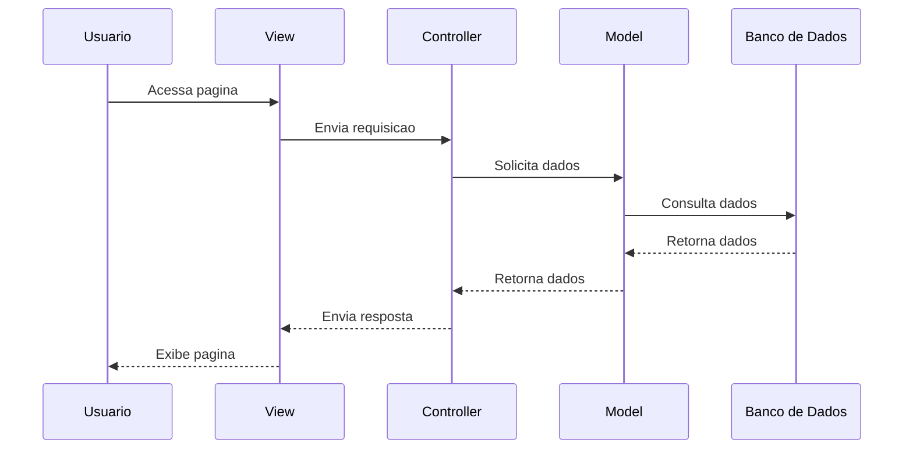

# 🌐 Arquitetura de Aplicações para Internet

## 📌 Conceito
A arquitetura de aplicações para Internet define **como os componentes de um sistema web são organizados e se comunicam**.

---

## 🧩 Modelos Arquiteturais

### 🔹 Cliente-Servidor
- Cliente (browser): HTML, CSS, JavaScript  
- Servidor: Node.js, Java, Python, PHP  
- Comunicação via HTTP/HTTPS  

---

### 🔹 Arquitetura em 3 Camadas (3-Tier)
1. **Apresentação (Front-end)**  
   - HTML5, CSS3, JavaScript  
   - Bootstrap  

2. **Lógica (Back-end)**  
   - Node.js (Express)  
   - Java (Spring MVC)  
   - Python (Django)  

3. **Dados (Banco de Dados)**  
   - MySQL, PostgreSQL  

---
### 🔹 MVC (Model-View-Controller)

O padrão **MVC (Model-View-Controller)** é uma arquitetura que separa a aplicação em três camadas, com o objetivo de **organizar o código, facilitar manutenção e permitir escalabilidade**.

---

## 🧩 Estrutura Geral

Usuário → View → Controller → Model → Banco de Dados  
                     ↑ ↓  
                   resposta  

---

## 📦 1. Model (Modelo)

### 📌 Função:
Responsável por **gerenciar os dados e as regras de negócio** da aplicação.

### 🔍 O que faz:
- Acessa o banco de dados (CRUD)
- Define regras (validações, cálculos)
- Representa entidades do sistema (ex: Usuário, Produto)

### 💻 Exemplo (Node.js / JavaScript):

    class Usuario {
      constructor(nome, email) {
        this.nome = nome;
        this.email = email;
      }

      salvar() {
        // lógica para salvar no banco
      }
    }

### 🧠 Importante:
- Não sabe nada sobre interface (HTML)
- Não depende da View ou Controller

---

## 🖥️ 2. View (Visão)

### 📌 Função:
Responsável pela **interface com o usuário**.

### 🔍 O que faz:
- Exibe dados (HTML, CSS)
- Recebe interações (cliques, formulários)
- Não contém lógica de negócio

### 💻 Exemplo (HTML):

    <h1>Lista de Usuários</h1>
    <ul>
      <li>João</li>
      <li>Maria</li>
    </ul>

### 🧠 Importante:
- Apenas apresenta dados
- Não acessa banco diretamente

---

## 🎮 3. Controller (Controlador)

### 📌 Função:
Responsável por **intermediar a comunicação entre Model e View**.

### 🔍 O que faz:
- Recebe requisições do usuário
- Processa ações
- Chama o Model
- Retorna resposta para a View

### 💻 Exemplo (Node.js / Express):

    app.get('/usuarios', (req, res) => {
      const usuarios = Usuario.buscarTodos();
      res.render('usuarios', { usuarios });
    });

### 🧠 Importante:
- Contém lógica de fluxo (não regra de negócio)
- Atua como "cérebro" da aplicação

---

## 🔄 Fluxo Completo 

1. Usuário acessa uma página  
2. A View envia a requisição  
3. O Controller recebe a requisição  
4. O Controller chama o Model  
5. O Model acessa o banco de dados  
6. O Model retorna os dados  
7. O Controller envia os dados para a View  
8. A View exibe ao usuário  

## 🔄 Fluxo Completo (Diagrama MVC)

---

## 📊 Vantagens do MVC

✔ Separação de responsabilidades  
✔ Código mais organizado  
✔ Facilita manutenção  
✔ Reutilização de componentes  
✔ Escalabilidade  

---

## ⚠️ Desvantagens

❌ Pode ser mais complexo no início  
❌ Exige disciplina na separação das camadas  

---

## 🧠 Exemplo Real de Tecnologias

| Camada | Tecnologias |
|--------|------------|
| Model | MySQL, MongoDB, ORM (Sequelize, Hibernate) |
| View | HTML, CSS, Bootstrap, React |
| Controller | Node.js (Express), Spring MVC, Django |

---

## 🔹 Arquitetura baseada em APIs (REST)

A arquitetura **REST (Representational State Transfer)** permite a comunicação entre sistemas web de forma padronizada, escalável e desacoplada.

---

## 📌 Conceito

- Baseada no protocolo **HTTP**
- Recursos acessados por **URLs (endpoints)**
- Comunicação em **JSON**
- Separação entre front-end e back-end

---

## 🔗 Estrutura

### 🔹 Endpoints
- `/usuarios`, `/produtos`, `/pedidos`

### 🔹 Métodos HTTP

| Método | Função |
|--------|--------|
| GET    | Buscar |
| POST   | Criar |
| PUT    | Atualizar |
| DELETE | Remover |

---

## ⚙️ Características

- **Stateless**: requisições independentes  
- **Cliente-Servidor**: separação de responsabilidades  
- **Cacheável**: melhora desempenho  
- **Interface uniforme**  

---
## 🧠 Arquitetura de Dados

Refere-se à forma como os dados são **estruturados, armazenados e gerenciados** dentro do sistema.

- **Modelagem de dados:**
  - Modelo Entidade-Relacionamento (ER)
  - Modelo relacional (tabelas, chaves primárias/estrangeiras)

- **Persistência:**
  - Armazenamento em bancos de dados (SQL ou NoSQL)
  - Uso de ORMs (ex: Sequelize, Hibernate)

- **Integridade dos dados:**
  - Restrições (NOT NULL, UNIQUE, FOREIGN KEY)
  - Consistência entre tabelas

- **Segurança:**
  - Controle de acesso aos dados
  - Criptografia e proteção de informações sensíveis

---

## 🧭 Arquitetura da Informação

Foca na **organização e apresentação do conteúdo** para o usuário.

- **Estrutura do sistema:**
  - Organização de páginas e conteúdos
  - Hierarquia da informação

- **Navegação:**
  - Menus, links e fluxos de uso
  - Facilidade de acesso às funcionalidades

- **Usabilidade (UX/UI):**
  - Interface intuitiva e amigável
  - Experiência do usuário (facilidade de uso)

- **Padronização visual:**
  - Layout consistente
  - Uso de cores, tipografia e componentes

---

## ⚙️ Arquitetura de Sistema

Define como os componentes do sistema **se conectam e funcionam em conjunto**.

- **Front-end:**
  - Interface do usuário (HTML, CSS, JS)
  - Responsável pela interação

- **Back-end:**
  - Regras de negócio e processamento
  - APIs e controle da aplicação

- **Banco de dados:**
  - Armazenamento das informações
  - Comunicação com o back-end

- **Integração:**
  - Comunicação via APIs (REST)
  - Troca de dados entre camadas

- **Escalabilidade e desempenho:**
  - Suporte a múltiplos usuários
  - Uso de servidores, cache e balanceamento

---
# 🚀 Arquitetura de Sistemas Web Escaláveis

## 📌 Conceito
Escalabilidade é a capacidade do sistema de **suportar crescimento de usuários, dados e requisições**, mantendo desempenho, disponibilidade e estabilidade.

---

## 📈 Tipos de Escalabilidade

### 🔹 Vertical (Scale Up)
Consiste em aumentar os recursos de um único servidor.

- Upgrade de CPU, RAM ou armazenamento  
- Simples de implementar  
- Não exige mudanças na arquitetura  

⚠️ Limitações:
- Custo elevado  
- Limite físico do hardware  
- Ponto único de falha  

---

### 🔹 Horizontal (Scale Out)
Consiste em adicionar múltiplos servidores trabalhando juntos.

- Distribuição de carga entre servidores  
- Alta disponibilidade  
- Tolerância a falhas  

✔ Mais utilizado em sistemas modernos (cloud)

---

## 🧩 Estratégias de Escalabilidade

### 🔹 Balanceamento de Carga
Distribui as requisições entre vários servidores.

- Evita sobrecarga em um único servidor  
- Melhora desempenho e disponibilidade  
- Pode ser feito por software (Nginx) ou cloud  

---

### 🔹 Microsserviços
Divide o sistema em pequenos serviços independentes.

- Cada serviço executa uma função específica  
- Comunicação via APIs (REST)  
- Permite escalar apenas partes do sistema  

✔ Exemplo: serviço de usuários, pagamentos, produtos  

---

### 🔹 APIs REST
Responsáveis pela comunicação entre serviços.

- Troca de dados via JSON  
- Uso de endpoints e métodos HTTP  
- Permite integração entre diferentes tecnologias  

---

### 🔹 Cache
Armazena dados temporariamente para acesso rápido.

- Reduz consultas ao banco de dados  
- Aumenta desempenho  
- Pode ser em memória (Redis, Memcached)  

✔ Ideal para dados muito acessados  

---

### 🔹 Containers e DevOps
Facilitam a implantação e escalabilidade.

- Docker: empacota aplicações com dependências  
- Permite replicar ambientes rapidamente  
- Integração contínua (CI/CD) automatiza deploy  

---

### 🔹 Banco de Dados Escalável

#### 🔸 Replicação
- Cópias do banco em múltiplos servidores  
- Leitura distribuída  

#### 🔸 Sharding
- Divisão dos dados em diferentes bancos  
- Cada servidor armazena parte dos dados  

✔ Aumenta capacidade e desempenho  

---

## ⚠️ Desafios da Escalabilidade

- Consistência de dados  
- Latência de rede  
- Monitoramento do sistema  
- Segurança em ambientes distribuídos  

---