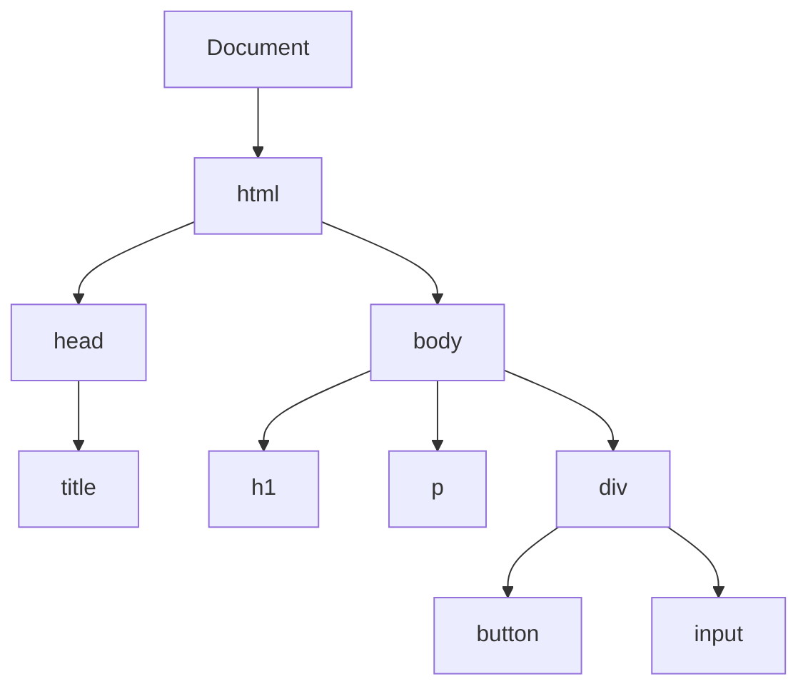

# 🧩 Páginas Dinâmicas e Interatividade no Frontend

## 📌 Diferença entre páginas estáticas e dinâmicas

### 🔹 Página estática
- Conteúdo fixo (**HTML puro**)
- Não muda sem recarregar a página
- Não depende de interação com o usuário

📍 **Exemplo:**
- Um site institucional simples

---

### 🔹 Página dinâmica
- Conteúdo pode ser alterado em tempo real
- Responde a ações do usuário
- Pode consumir dados de APIs

📍 **Exemplo:**
- Redes sociais  
- Sistemas web (login, dashboards)

---

## 🔄 Atualização sem recarregar a página

Uma das principais características de páginas modernas é atualizar conteúdo **sem recarregar (reload)** a página inteira.

Isso melhora:
- ⚡ Performance  
- 🎯 Experiência do usuário  
- 🔄 Fluidez da navegação  

---

### 🔹 Exemplo com Fetch API

```javascript
fetch("https://api.exemplo.com/dados")
  .then(res => res.json())
  .then(data => {
    document.getElementById("resultado").innerText = data.nome;
  });
```

📌 **O que acontece aqui:**
1. A aplicação faz uma requisição para uma API  
2. Recebe os dados em formato JSON  
3. Atualiza apenas uma parte da página (sem reload)

---

## 🌐 Conceito de SPA (Single Page Application)

SPA é uma aplicação que funciona em **uma única página**, sem recarregamento completo.

---

### 🔹 Características
- Navegação sem reload  
- Atualização parcial da interface  
- Uso intensivo de JavaScript  

---

### 🔹 Como funciona
- O navegador carrega uma única página HTML  
- O JavaScript controla o conteúdo exibido  
- Os dados são buscados dinamicamente via APIs  

---

## 🧠 Estado da aplicação (State)

O **estado (state)** representa os dados atuais da interface.

---

### 🔹 Exemplos de estado
- Usuário logado  
- Lista de itens carregados  
- Dados de um formulário  

---

### 🔹 Importância
- Controla o que aparece na tela  
- Permite atualização dinâmica  
- Base para frameworks modernos (React, Vue, etc.)  

---

## ⚙️ Manipulação dinâmica com JavaScript

A base da interatividade no frontend é a manipulação do **DOM (Document Object Model)**.

### 🔹 Representação do DOM (árvore)



---

### 🔹 Alteração de conteúdo

```javascript
document.getElementById("titulo").innerText = "Novo título";
```

📌 Altera o texto de um elemento já existente na página.

---

### 🔹 Criação de elementos

```javascript
const novoElemento = document.createElement("p");
novoElemento.innerText = "Texto criado dinamicamente";
document.body.appendChild(novoElemento);
```

📌 Cria um novo elemento HTML e adiciona ao DOM.

---

### 🔹 Remoção de elementos

```javascript
const elemento = document.getElementById("item");
elemento.remove();
```

📌 Remove um elemento da página.

---

## 🎯 Eventos e interatividade

Eventos permitem que a página **reaja às ações do usuário**.

---

### 🔹 Exemplo de evento

```javascript
document.getElementById("btn").addEventListener("click", () => {
  alert("Clicou!");
});
```

📌 Quando o usuário clica no botão, uma ação é executada.

---

### 🔹 Tipos comuns de eventos
- `click` → clique do mouse  
- `input` → digitação em campos  
- `submit` → envio de formulário  
- `mouseover` → passar o mouse  

---