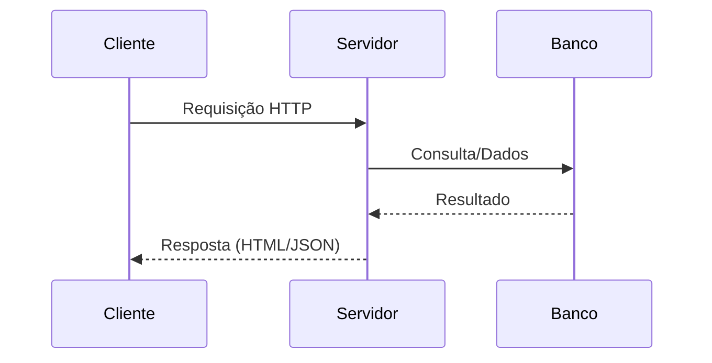

# 🖥️ Programação do Lado Servidor e Páginas Dinâmicas no Back-end

## 📌 Conceito de Programação do Lado Servidor

A programação do lado servidor (back-end) é responsável por **toda a lógica que acontece “por trás” da aplicação web**.

Enquanto o usuário interage com a interface (frontend), o backend é quem:

- Processa requisições enviadas pelo navegador  
- Aplica regras de negócio (ex: validação de login, cálculos, etc.)  
- Acessa e manipula dados no banco de dados  
- Gera respostas (HTML, JSON, arquivos, etc.)  

📌 **Importante:**
- Frontend → roda no navegador do usuário  
- Backend → roda em um servidor (local ou remoto)  

---

## 🔄 Fluxo de funcionamento de uma aplicação web



📌 **Passo a passo:**
1. O cliente (navegador) faz uma requisição (ex: acessar uma página)  
2. O servidor recebe essa requisição  
3. O servidor consulta o banco de dados (se necessário)  
4. O banco retorna os dados  
5. O servidor processa e envia uma resposta ao cliente  

👉 Esse fluxo é a base de praticamente qualquer sistema web.

---

## 🧠 Linguagens utilizadas no Back-end

De acordo com a bibliografia, diferentes linguagens podem ser usadas no servidor:

### 🔹 Java
- Servlets → processamento de requisições HTTP  
- JSP → geração de páginas dinâmicas  
- Spring → framework moderno para aplicações robustas  

📌 Muito usado em sistemas corporativos.

---

### 🔹 Python
- Django → framework completo (rápido e produtivo)  
- Flask → mais simples e flexível  

📌 Muito usado em aplicações modernas e APIs.

---

### 🔹 JavaScript (Node.js)
- Permite usar JavaScript no servidor  
- Express → framework leve para criar APIs  

📌 Muito usado para APIs REST e aplicações rápidas.

---

### 🔹 PHP
- Laravel → framework moderno  

📌 Muito usado em sistemas web tradicionais.

---

## ⚙️ Exemplo simples de código no servidor (Node.js)

```javascript
const express = require('express'); // importa o framework
const app = express(); // cria a aplicação

// rota principal (quando acessar "/")
app.get('/', (req, res) => {
  res.send('Olá, mundo!'); // envia resposta ao cliente
});

// inicia o servidor
app.listen(3000, () => {
  console.log('Servidor rodando na porta 3000');
});
```

📌 **Explicação:**
- `require('express')` → importa a biblioteca  
- `app.get()` → define uma rota HTTP  
- `req` → dados da requisição  
- `res` → resposta que será enviada  
- `res.send()` → envia conteúdo para o navegador  
- `listen()` → inicia o servidor  

👉 Esse é o básico de qualquer servidor web.

---

## 🌐 Páginas geradas pelo Back-end

O backend pode gerar páginas HTML dinamicamente antes de enviar ao cliente.

---

## 🔄 Tipos de renderização

### 🔹 Server-Side Rendering (SSR)

- HTML é gerado no servidor  
- Enviado pronto para o navegador  

📍 Exemplo:
- JSP  
- Django Templates  

📌 Vantagem:
- Melhor SEO  
- Carregamento inicial rápido  

---

### 🔹 Client-Side Rendering (CSR)

- HTML inicial é simples  
- JavaScript monta a interface  

📍 Exemplo:
- React  
- Vue  

📌 Vantagem:
- Interface mais dinâmica  

---

## 🧠 Integração com Banco de Dados

O backend é responsável por acessar e manipular dados.

---

### 🔹 Exemplo conceitual

```javascript
const usuarios = await banco.buscarUsuarios();
res.json(usuarios);
```

📌 Fluxo:
1. O servidor consulta o banco  
2. Recebe os dados  
3. Envia os dados para o cliente  

---

## 🔐 Segurança no Back-end

O backend deve garantir segurança da aplicação.

---

### 🔹 Principais responsabilidades

- Autenticação → verificar identidade (login)  
- Autorização → verificar permissões  
- Validação → evitar dados inválidos  
- Proteção → evitar ataques (SQL Injection, XSS)  

---

## 🔗 Resumo geral

O back-end é responsável por:

- Processar requisições do cliente  
- Aplicar regras de negócio  
- Gerar páginas ou dados  
- Integrar com banco de dados  

E utiliza:

- Linguagens (Java, Python, Node, PHP)  
- Frameworks (Spring, Django, Express)  
- Padrões (MVC, REST)  
- Práticas de segurança  