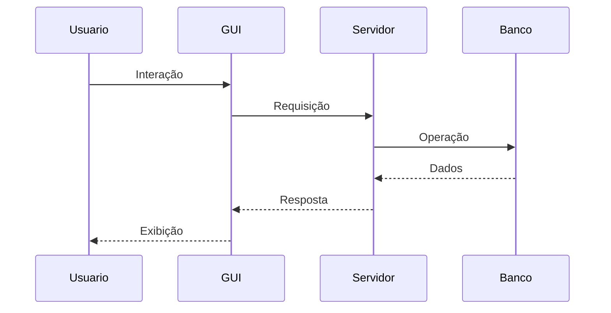

# 🖥️ Construção de GUI para Aplicações com Banco de Dados

## 📌 Conceito de GUI

A GUI (Graphical User Interface) é a interface visual que permite ao usuário interagir com o sistema.

Ela é responsável por:
- Entrada de dados  
- Visualização de informações  
- Execução de ações  

📌 **Importante:**
- GUI → interface (frontend)  
- Backend → lógica da aplicação  
- Banco de dados → armazenamento  

---

## 🔄 Fluxo de funcionamento



---

## 🧩 Componentes da GUI

| Elemento | Função |
|----------|--------|
| Input | Entrada de dados |
| Botão | Executar ações |
| Lista/Tabela | Exibir dados |
| Formulário | Agrupar inputs |
| Mensagens | Feedback |

---

# 🔄 Operações CRUD na GUI

A GUI deve permitir manipular dados através das operações CRUD.

---

## ➕ Create (Criar)

```html
<input type="text" id="nome" placeholder="Nome">
<button onclick="adicionar()">Salvar</button>
```

---

## 📖 Read (Ler)

```html
<ul id="lista"></ul>
```

---

## ✏️ Update (Atualizar)

```html
<button onclick="editar(index)">Editar</button>
```

---

## ❌ Delete (Excluir)

```html
<button onclick="remover(index)">Excluir</button>
```

---

# 💻 Exemplo completo (CRUD em JavaScript)

```html
<!DOCTYPE html>
<html>
<head>
  <title>CRUD Simples</title>
</head>
<body>

<h2>Cadastro</h2>

<input type="text" id="nome" placeholder="Digite um nome">
<button onclick="adicionar()">Adicionar</button>

<ul id="lista"></ul>

<script>
let dados = [];
let editando = -1;

// CREATE
function adicionar() {
  const input = document.getElementById("nome");
  const nome = input.value;

  if (nome === "") return;

  if (editando >= 0) {
    dados[editando] = nome; // UPDATE
    editando = -1;
  } else {
    dados.push(nome); // CREATE
  }

  input.value = "";
  renderizar();
}

// READ
function renderizar() {
  const lista = document.getElementById("lista");
  lista.innerHTML = "";

  dados.forEach((item, index) => {
    lista.innerHTML += `
      <li>
        ${item}
        <button onclick="editar(${index})">Editar</button>
        <button onclick="remover(${index})">Excluir</button>
      </li>
    `;
  });
}

// UPDATE
function editar(index) {
  document.getElementById("nome").value = dados[index];
  editando = index;
}

// DELETE
function remover(index) {
  dados.splice(index, 1);
  renderizar();
}
</script>

</body>
</html>
```

---

## 🔗 Integração com Backend 
```javascript
fetch('/usuarios', {
  method: 'POST',
  body: JSON.stringify({ nome: "João" })
});
```

📌 A GUI envia dados → backend processa → banco armazena  

---

## 🎨 Boas práticas

### 🔹 Usabilidade
- Interface simples  
- Navegação clara  

### 🔹 Feedback
- Mensagens de sucesso/erro  
- Indicação de carregamento  

### 🔹 Consistência
- Padrões visuais iguais  
- Organização dos elementos  

---

## 🔐 Validação de dados

- Campos obrigatórios  
- Tipos corretos  
- Evitar envio inválido  

---

## 🔗 Resumo geral

A construção de GUI envolve:

- Interface visual  
- Interação com usuário  
- Operações CRUD  
- Integração com backend  

📌 **Objetivo final:**
> Permitir manipulação de dados de forma simples, eficiente e segura  