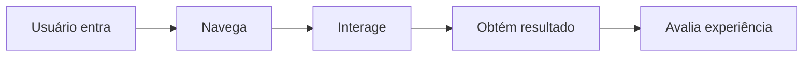

# 🎨 Experiência do Usuário (UX)

## 📌 Conceito

Experiência do Usuário (UX - User Experience) refere-se à forma como o usuário percebe e interage com um sistema.

Envolve:
- Facilidade de uso  
- Eficiência  
- Emoções durante o uso  

---

## 🎯 Objetivo da UX

Criar sistemas que sejam:

- Úteis  
- Fáceis de usar  
- Agradáveis  
- Eficientes  

---

## 🧩 Elementos da UX

| Elemento | Descrição |
|----------|----------|
| Usabilidade | Facilidade de uso |
| Design visual | Aparência da interface |
| Performance | Velocidade do sistema |
| Acessibilidade | Inclusão de todos usuários |
| Conteúdo | Clareza das informações |

---

## 🔄 Jornada do Usuário

---

## 💡 Princípios de UX

### 🔹 Simplicidade
- Interface limpa  
- Poucos elementos  

### 🔹 Clareza
- Informações objetivas  
- Linguagem simples  

### 🔹 Consistência
- Padrões visuais  
- Comportamento previsível  

### 🔹 Feedback
- Respostas imediatas  
- Mensagens claras  

### 🔹 Eficiência
- Menos passos para concluir tarefas  

---

## 💻 Exemplos práticos

### ✔️ Boa UX
- Formulário simples  
- Botões claros  
- Feedback após ação  

### ❌ Má UX
- Interface confusa  
- Muitos cliques  
- Falta de resposta  

---

## 📱 UX em dispositivos móveis

- Design responsivo  
- Botões grandes  
- Navegação simples  
- Carregamento rápido  

---

## ⚙️ Testes de UX

- Teste com usuários reais  
- Teste A/B  
- Análise de comportamento  

📌 Objetivo:
- Identificar problemas  
- Melhorar a experiência  

---

## 🔐 Boas práticas

- Reduzir esforço do usuário  
- Evitar erros  
- Priorizar tarefas principais  
- Organizar informações  

---

## 🎨 UX x UI

| UX | UI |
|----|----|
| Experiência | Interface visual |
| Funcionalidade | Aparência |
| Usabilidade | Design |

---

## 🔗 Resumo

A UX busca melhorar a interação do usuário com o sistema, garantindo:

- Facilidade  
- Eficiência  
- Satisfação  

📌 **Conclusão:**
> Um sistema com boa UX atende às necessidades do usuário de forma simples, rápida e agradável.