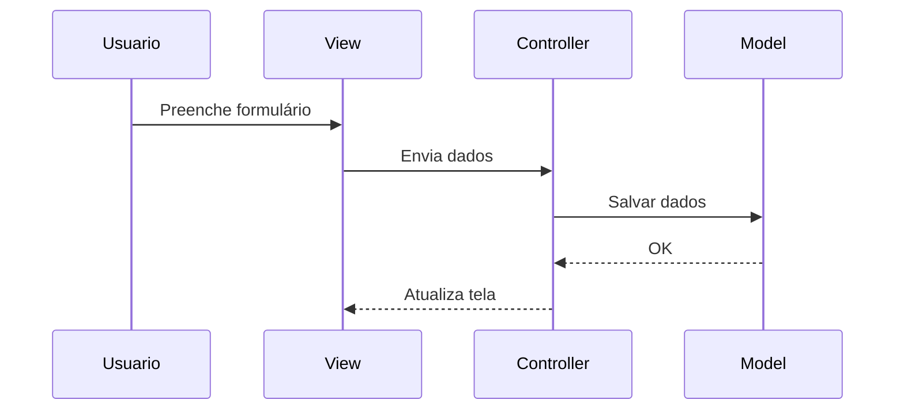

# 🏗️ Arquitetura MVC (Model-View-Controller)

## 📌 Conceito

MVC é um padrão de arquitetura que separa a aplicação em três partes:

- **Model** → dados e regras de negócio  
- **View** → interface com o usuário (GUI)  
- **Controller** → controla as ações e comunicação  

📌 Objetivo:
> Organizar o sistema e separar responsabilidades

---

## 🧩 Estrutura do MVC


---

## 🎯 Função de cada camada

| Camada | Responsabilidade |
|--------|----------------|
| Model | Manipula dados e banco |
| View | Exibe informações |
| Controller | Recebe ações e decide o fluxo |

---

## 💻 Exemplo simples (conceitual)

### 🖥️ View (interface)
```html
<input type="text" id="nome">
<button onclick="salvar()">Salvar</button>
```

---

### 🎮 Controller (controle)
```javascript
function salvar() {
  const nome = document.getElementById("nome").value;
  model.adicionar(nome);
}
```

---

### 🧠 Model (dados)
```javascript
let dados = [];

function adicionar(nome) {
  dados.push(nome);
}
```

---

## 🔄 Fluxo na prática

1. Usuário interage com a **View**  
2. A ação vai para o **Controller**  
3. O Controller chama o **Model**  
4. O Model processa os dados  
5. A View é atualizada  

---

### 🔹 Fluxo (Create)



---

## ⚙️ Vantagens do MVC

- Separação de responsabilidades  
- Código mais organizado  
- Facilita manutenção  
- Permite trabalho em equipe  

---

## ⚠️ Sem MVC

- Código misturado (HTML + lógica + dados)  
- Difícil manutenção  
- Maior chance de erros  

---

## 🔗 Comparação simples

| Sem MVC | Com MVC |
|--------|--------|
| Código misturado | Código separado |
| Difícil entender | Fácil organização |
| Difícil manter | Fácil manutenção |

---

## 🔗 Resumo

MVC divide o sistema em:

- Model → dados  
- View → interface  
- Controller → controle  

📌 **Conclusão:**
> O padrão MVC melhora a organização, manutenção e escalabilidade do sistema.